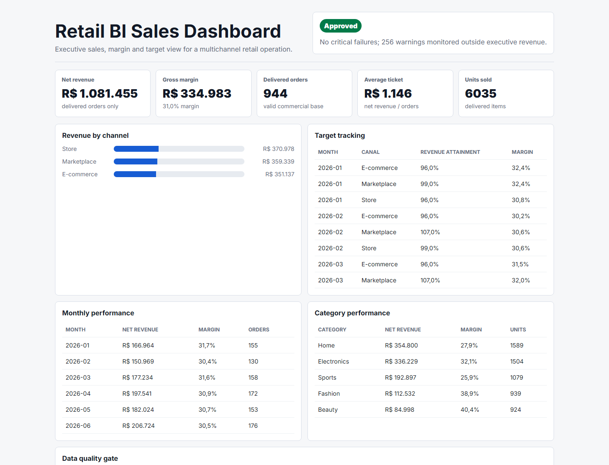

# Retail BI Sales Dashboard: executive decisions on revenue, margin and targets

[Portuguese version](README.pt-BR.md)

Business Intelligence case study built around an executive question: **is the operation selling well, protecting margin and meeting targets by channel?**

The case simulates an executive dashboard for multichannel retail. The goal is not just listing sales KPIs; it is turning orders, items, products, customers and targets into a management read: where revenue is concentrated, where margin is under pressure and where targets may be poorly calibrated.

The project is structured to demonstrate professional BI delivery: reproducible data, analytical model, KPIs, validations, DAX measures, HTML dashboard and executive recommendations.

## Executive Summary

**Core question:** is the BI layer ready to support commercial decision-making?

**Short answer:** yes. The model is **Approved** for executive publication: there are no critical data quality failures in the BI base. There are **256 warnings** related to cancelled orders with potential revenue, but these orders are excluded from executive KPIs and monitored separately.

**Recommended decision:** use the dashboard to protect margin in pressured categories, especially **Esporte**, and review targets where actuals repeatedly exceed plan.

| Metric | Result |
|---|---:|
| Net revenue | R$ 1,081,455 |
| Gross margin | R$ 334,983 |
| Gross margin rate | 31.0% |
| Delivered orders | 944 |
| Average ticket | R$ 1,146 |
| Units sold | 6,035 |
| Publication status | Approved |

## Why This Case Matters

Retail BI is the most familiar case for many data and BI recruiters. For that reason, it must be defended as **executive decision support**, not as a generic dashboard.

Interview version: "I built a BI layer that separates delivered and cancelled orders, calculates revenue and margin at the correct grain, compares actuals against targets and points to where management should act."

The case demonstrates:

1. **Classic BI executed well:** commercial KPIs, targets, channels and categories.
2. **Analytical modeling:** facts, dimensions and metrics calculated at the right grain.
3. **Quality before publication:** cancelled orders do not enter executive revenue.
4. **Executive storytelling:** revenue, margin and targets become management recommendations.

## Business Problem

A retail company needs to monitor revenue, margin and targets by channel, month and category. Without a single analytical layer, management is slow to answer:

- Which channel generates the most revenue?
- Is margin healthy?
- Which categories sell a lot but pressure profitability?
- Are monthly targets calibrated?
- Are the data ready to refresh the executive dashboard?

## Analytical Read

The operation delivers **R$ 1.08M** in net revenue, **R$ 335k** in gross margin and **31.0%** margin rate. **Store** leads revenue with **R$ 370,978**, but the gap across channels is small: Store, Marketplace and E-commerce are close in share.

By category, **Casa** leads revenue with **R$ 354,800**, but it is not the most profitable category. The lowest margin is **Esporte**, at **25.9%**, making it a priority for commercial investigation: pricing, discounting, product mix, cost or campaign strategy.

Monthly revenue grows from **R$ 166,964** in January to **R$ 206,724** in June. At the same time, margin rate declines from **31.7%** to **30.5%**. The executive read is useful: revenue is growing, but profitability needs protection.

The best target attainment is **2026-03 / Marketplace**, at **107.0%**. When a channel repeatedly exceeds target, the issue may not be only strong performance; the target itself may be underestimated.

## Delivery

The project delivers:

- reproducible synthetic base with 1,200 orders and 3,012 items;
- analytical model in DuckDB;
- SQL for KPIs, targets, channels, categories and products;
- quality checks before publication;
- documented DAX measures for Power BI;
- HTML dashboard with the main indicators;
- CSV outputs for audit and reuse.

## Dashboard

Open the local dashboard at:

```text
dashboard/retail_bi_sales_dashboard.html
```

Explicit language variants are also generated:

```text
dashboard/retail_bi_sales_dashboard_en.html
dashboard/retail_bi_sales_dashboard_pt-BR.html
```



## Main Findings

- Highest-revenue channel: **Store**, with **R$ 370,978**.
- Highest-revenue category: **Casa**, with **R$ 354,800**.
- Lowest-margin category: **Esporte**, with **25.9%**.
- Best target attainment: **2026-03 / Marketplace**, with **107.0%**.
- Recommendation: protect margin in lower-profitability categories and review targets where actuals repeatedly exceed plan.

## Generated Outputs

- `outputs/executive_findings.md`: English executive findings.
- `outputs/executive_findings.pt-BR.md`: Portuguese executive findings.
- `outputs/kpi_summary.csv`: general KPIs.
- `outputs/monthly_performance.csv`: monthly trend.
- `outputs/channel_performance.csv`: revenue, margin and share by channel.
- `outputs/category_performance.csv`: revenue and margin by category.
- `outputs/target_tracking.csv`: actual vs target by month and channel.
- `outputs/product_ranking.csv`: product ranking.
- `outputs/dq_summary.csv`: quality rules and severity.
- `outputs/dashboard_data.json`: data used by the HTML dashboard.

## Stack

- Python for data generation and orchestration.
- DuckDB for local analytical modeling.
- SQL for transformations, validations and KPIs.
- Power BI/DAX as the final consumption design.
- HTML/CSS for a static dashboard reviewable in the repository.

## Reproduce

```bash
pip install -r requirements.txt
python scripts/build_outputs.py
python scripts/run_sql.py
```

The first command generates data, DuckDB database, CSVs, dashboard and executive findings. The second prints SQL queries to the terminal for technical review.

## Analytical Model

The model follows a simple star schema:

- `fact_sales`: sold items, revenue, cost and margin.
- `dim_orders`: order, date, channel, status, payment and state.
- `dim_products`: product, category and subcategory.
- `dim_customers`: customer, segment, city and state.
- `fact_targets`: monthly targets by channel.

## Quality Criteria

The executive dashboard can be published when:

- there are no critical failures;
- cancelled orders are excluded from executive revenue;
- discounts, prices, costs and key references pass validation;
- warnings are documented for operational follow-up.

## Simulated Recommendations

1. Protect margin in **Esporte** by investigating discounting, cost, mix and campaigns.
2. Monitor **Casa** carefully: it is the largest category by revenue, but not the best by margin rate.
3. Review targets for channels that frequently exceed plan, separating strong execution from underestimated targets.
4. Keep cancelled orders out of executive KPIs, but visible as an operational warning.
5. Use the dashboard as a monthly management read: revenue, margin, target and data quality in the same workflow.

## Author

Bruno Nascimento  
[LinkedIn](https://linkedin.com/in/bruniversamente) | [GitHub](https://github.com/bruniversamente)
