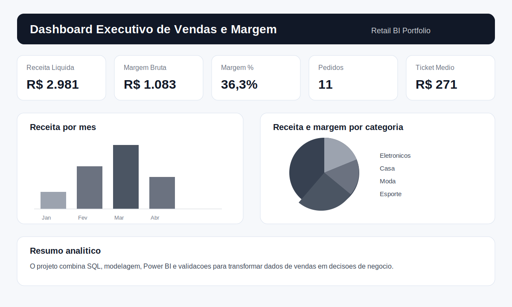

# Dashboard Executivo de Vendas e Margem para Varejo

Projeto de Business Intelligence para análise de performance comercial em uma operação de varejo multicanal. O objetivo é transformar dados transacionais de pedidos, produtos, clientes e metas em indicadores executivos para apoiar decisões de gestão.

> Dados sintéticos criados para fins de portfólio. O projeto simula um cenário real de BI/MIS, com foco em SQL, Power BI, KPIs, qualidade de dados e narrativa de negócio.

## Problema de negócio

Uma operação de varejo precisa acompanhar vendas, margem e desempenho comercial por mês, canal, estado e categoria. Os dados existem em tabelas separadas e não há uma visão única para responder rapidamente perguntas como:

- A receita está crescendo ou caindo?
- Quais categorias vendem mais e quais geram mais margem?
- Existe concentração de receita em poucos canais ou regiões?
- As metas mensais estão sendo cumpridas?
- Há inconsistências nos dados antes de divulgar os indicadores?

## Objetivo do projeto

Construir uma base analítica e um modelo de dashboard para monitorar KPIs comerciais, identificar desvios e transformar dados operacionais em recomendações de negócio.

## Ferramentas e competências demonstradas

- SQL para consultas analíticas, joins, agregações e validações.
- Power BI para modelagem, medidas DAX e especificação de dashboard.
- Python para geração de base sintética e reprodutibilidade.
- DuckDB como engine local para consultas SQL.
- Documentação de regras de negócio, dicionário de dados e qualidade dos dados.
- Storytelling com dados para apoiar decisões executivas.

## Estrutura do repositório

```text
retail-bi-sales-dashboard/
├── data/
│   ├── sample_orders.csv
│   ├── sample_order_items.csv
│   ├── sample_products.csv
│   ├── sample_customers.csv
│   ├── sample_targets.csv
│   └── README.md
├── docs/
│   ├── business_rules.md
│   ├── dashboard_blueprint.md
│   └── data_dictionary.md
├── images/
│   └── dashboard_preview.svg
├── powerbi/
│   └── measures_dax.md
├── scripts/
│   ├── generate_retail_data.py
│   └── run_sql.py
├── sql/
│   ├── 01_create_schema_duckdb.sql
│   ├── 02_data_quality_checks.sql
│   └── 03_kpi_queries.sql
├── requirements.txt
└── README.md
```

## Modelo analítico

O modelo foi pensado em formato estrela:

- `fact_sales`: itens vendidos, receita, custo e margem.
- `dim_orders`: dados do pedido, data, canal, status, pagamento e UF.
- `dim_products`: produto, categoria e subcategoria.
- `dim_customers`: cliente e segmento.
- `fact_targets`: metas mensais de receita e margem.

## KPIs principais

- Receita bruta
- Receita líquida
- Custo dos produtos vendidos
- Margem bruta
- Margem percentual
- Pedidos entregues
- Ticket médio
- Receita por mês
- Receita por canal
- Receita e margem por categoria
- Aderência à meta mensal

## Prévia do dashboard



## Como executar localmente

1. Clone o repositório:

```bash
git clone https://github.com/bruniversamente/retail-bi-sales-dashboard.git
cd retail-bi-sales-dashboard
```

2. Instale as dependências:

```bash
pip install -r requirements.txt
```

3. Execute os scripts SQL com DuckDB:

```bash
python scripts/run_sql.py
```

4. Gere uma base maior, caso queira substituir os arquivos de exemplo:

```bash
python scripts/generate_retail_data.py
```

## Principais insights esperados

Em uma análise desse tipo, o dashboard permite identificar:

1. Categorias que vendem muito, mas entregam margem baixa.
2. Canais com alto volume e baixa rentabilidade.
3. Meses com queda de receita ou desvio em relação à meta.
4. Regiões com desempenho acima ou abaixo do esperado.
5. Produtos que concentram receita e exigem acompanhamento de estoque ou precificação.

## Recomendações de negócio simuladas

- Revisar descontos em categorias de alta receita e baixa margem.
- Acompanhar semanalmente o desempenho de canais com maior variação.
- Priorizar ações comerciais em regiões com boa margem e baixa penetração.
- Criar alertas para divergência entre receita realizada e meta mensal.
- Manter validações automáticas antes de atualizar relatórios executivos.

## Próximos passos

- Criar arquivo `.pbix` com modelo final no Power BI.
- Publicar screenshots reais do dashboard.
- Incluir análise de clientes recorrentes.
- Adicionar simulação de forecast simples para receita mensal.

## Autor

Bruno Nascimento  
[LinkedIn](https://linkedin.com/in/bruniversamente) | [GitHub](https://github.com/bruniversamente)
