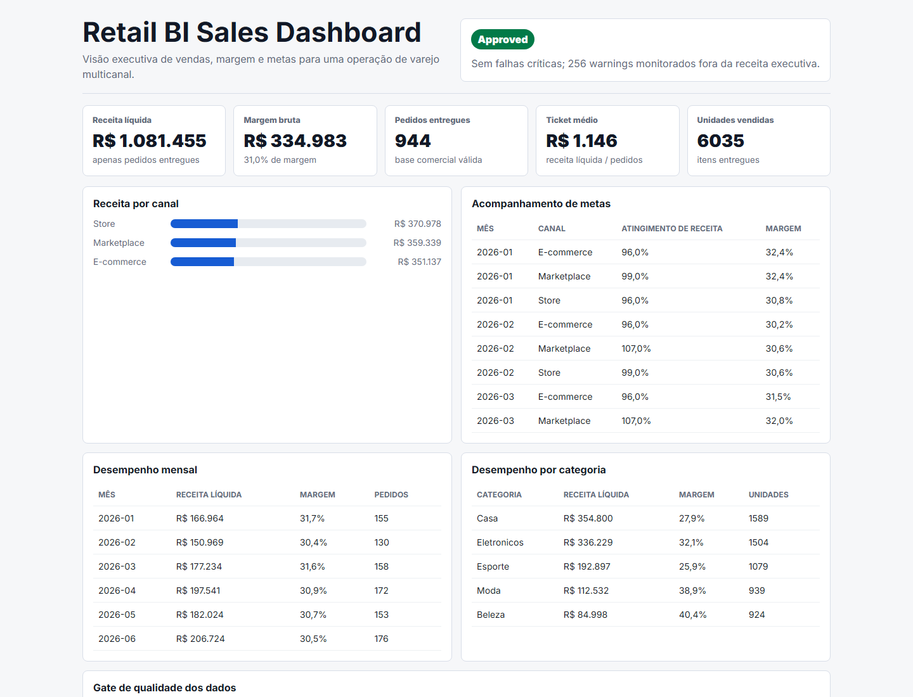

# Retail BI Sales Dashboard: decisão executiva de receita, margem e metas

[English version](README.md)

Estudo de caso de Business Intelligence para responder uma pergunta executiva: **a operação está vendendo bem, protegendo margem e cumprindo metas por canal?**

O case simula um dashboard executivo para varejo multicanal. A proposta não é apenas listar KPIs de vendas; é transformar pedidos, itens, produtos, clientes e metas em uma leitura de gestão: onde a receita está concentrada, onde a margem está pressionada e onde a meta parece mal calibrada.

O caso foi estruturado para demonstrar BI aplicado de forma profissional: dados reproduzíveis, modelo analítico, KPIs, validações, medidas DAX, dashboard HTML e recomendações executivas.

## Resumo executivo

**Pergunta central:** a camada de BI está pronta para orientar decisão comercial?

**Resposta curta:** sim. O modelo está **Approved** para publicação executiva: não há falhas críticas de qualidade nos dados usados para BI. Existem **256 warnings** de pedidos cancelados com receita potencial, mas esses pedidos são excluídos dos KPIs executivos e monitorados separadamente.

**Decisão recomendada:** usar o dashboard para proteger margem nas categorias mais pressionadas, especialmente **Esporte**, e revisar metas onde o realizado fica acima do planejado de forma recorrente.

| Indicador | Resultado |
|---|---:|
| Receita líquida | R$ 1.081.455 |
| Margem bruta | R$ 334.983 |
| Margem percentual | 31,0% |
| Pedidos entregues | 944 |
| Ticket médio | R$ 1.146 |
| Unidades vendidas | 6.035 |
| Status de publicação | Approved |

## Por que este case importa no portfólio

Retail BI é o case mais familiar para recrutadores de dados e BI. Por isso, ele precisa ser defendido como **decisão executiva**, não como dashboard genérico.

Em uma entrevista, a história pode ser resumida assim: "eu construí uma camada de BI que separa pedidos entregues de cancelados, calcula receita e margem no grão correto, compara realizado vs meta e aponta onde a gestão deve agir."

O case demonstra:

1. **BI clássico bem executado:** KPIs comerciais, metas, canais e categorias.
2. **Modelagem analítica:** fatos, dimensões e métricas calculadas no grão correto.
3. **Qualidade antes da publicação:** pedidos cancelados não entram na receita executiva.
4. **Storytelling executivo:** receita, margem e meta viram recomendação de gestão.

## Problema de negócio

Uma empresa de varejo precisa acompanhar receita, margem e metas por canal, mês e categoria. Sem uma camada analítica única, a gestão demora para responder perguntas simples:

- Qual canal gera mais receita?
- A margem está saudável?
- Quais categorias vendem muito, mas pressionam rentabilidade?
- As metas mensais estão calibradas?
- Os dados estão prontos para atualizar o dashboard executivo?

## Leitura analítica

A operação entrega **R$ 1,08M** de receita líquida, **R$ 335k** de margem bruta e margem percentual de **31,0%**. O canal **Store** lidera em receita com **R$ 370.978**, mas a diferença entre canais é pequena: Store, Marketplace e E-commerce ficam próximos em participação.

Por categoria, **Casa** lidera receita com **R$ 354.800**, mas não é a categoria mais rentável. A menor margem está em **Esporte**, com **25,9%**, o que torna essa categoria uma prioridade de investigação comercial: preço, desconto, mix de produtos, custo ou campanha.

A evolução mensal mostra crescimento de receita de **R$ 166.964** em janeiro para **R$ 206.724** em junho. Ao mesmo tempo, a margem percentual cai de **31,7%** para **30,5%**. Isso cria uma leitura executiva útil: a receita cresce, mas a rentabilidade precisa ser protegida.

O melhor atingimento de meta aparece em **2026-03 / Marketplace**, com **107,0%**. Quando um canal supera meta de forma recorrente, o problema pode não ser só performance positiva; pode ser meta subestimada.

## Entrega

O projeto entrega:

- base sintética reproduzível com 1.200 pedidos e 3.012 itens;
- modelo analítico em DuckDB;
- SQL para KPIs, metas, canais, categorias e produtos;
- checagens de qualidade antes da publicação;
- medidas DAX documentadas para Power BI;
- dashboard HTML com os principais indicadores;
- CSVs em `outputs/` para auditoria e reuso.

## Dashboard

Abra o dashboard local em:

```text
dashboard/retail_bi_sales_dashboard_pt-BR.html
```

Preview:



## Principais achados

- Canal com maior receita: **Store**, com **R$ 370.978**.
- Categoria com maior receita: **Casa**, com **R$ 354.800**.
- Categoria com menor margem: **Esporte**, com **25,9%**.
- Melhor atingimento de meta: **2026-03 / Marketplace**, com **107,0%**.
- Recomendação: proteger margem nas categorias de menor rentabilidade e revisar metas onde o realizado fica acima do planejado de forma recorrente.

## Saídas geradas

Os principais artefatos ficam em `outputs/`:

- `executive_findings.md`: resumo executivo em inglês.
- `executive_findings.pt-BR.md`: resumo executivo em português.
- `kpi_summary.csv`: KPIs gerais.
- `monthly_performance.csv`: evolução mensal.
- `channel_performance.csv`: receita, margem e participação por canal.
- `category_performance.csv`: receita e margem por categoria.
- `target_tracking.csv`: realizado vs meta por mês e canal.
- `product_ranking.csv`: ranking de produtos.
- `dq_summary.csv`: regras de qualidade e severidade.
- `dashboard_data.json`: dados usados no dashboard HTML.

## Stack

- Python para geração da base e orquestração.
- DuckDB para modelagem analítica local.
- SQL para transformações, validações e KPIs.
- Power BI/DAX como desenho de consumo final.
- HTML/CSS para dashboard estático revisável no repositório.

## Como rodar

```bash
pip install -r requirements.txt
python scripts/build_outputs.py
python scripts/run_sql.py
```

O primeiro comando gera dados, banco DuckDB, CSVs, dashboard e resumo executivo. O segundo imprime as consultas SQL no terminal para revisão técnica.

## Modelo analítico

O modelo segue uma estrutura simples em estrela:

- `fact_sales`: itens vendidos, receita, custo e margem.
- `dim_orders`: pedido, data, canal, status, pagamento e UF.
- `dim_products`: produto, categoria e subcategoria.
- `dim_customers`: cliente, segmento, cidade e estado.
- `fact_targets`: metas mensais por canal.

## Critério de qualidade

O dashboard executivo pode ser publicado quando:

- não existem falhas críticas;
- pedidos cancelados ficam fora da receita executiva;
- descontos, preços, custos e referências principais passam nas validações;
- warnings ficam documentados para acompanhamento operacional.

## Recomendações simuladas

1. Proteger margem em **Esporte**, investigando desconto, custo, mix e campanhas.
2. Monitorar **Casa** com cuidado: é a maior categoria em receita, mas não a melhor em margem percentual.
3. Revisar metas de canais que superam plano com frequência, para separar execução forte de meta subestimada.
4. Manter pedidos cancelados fora dos KPIs executivos, mas visíveis como alerta operacional.
5. Usar o dashboard como leitura mensal de gestão: receita, margem, meta e qualidade de dados no mesmo fluxo.

## Autor

Bruno Nascimento  
[LinkedIn](https://linkedin.com/in/bruniversamente) | [GitHub](https://github.com/bruniversamente)
